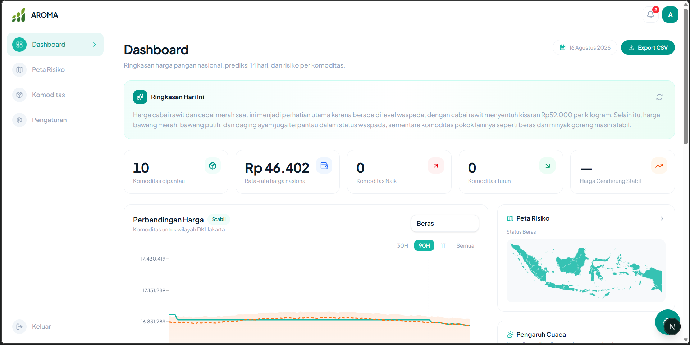
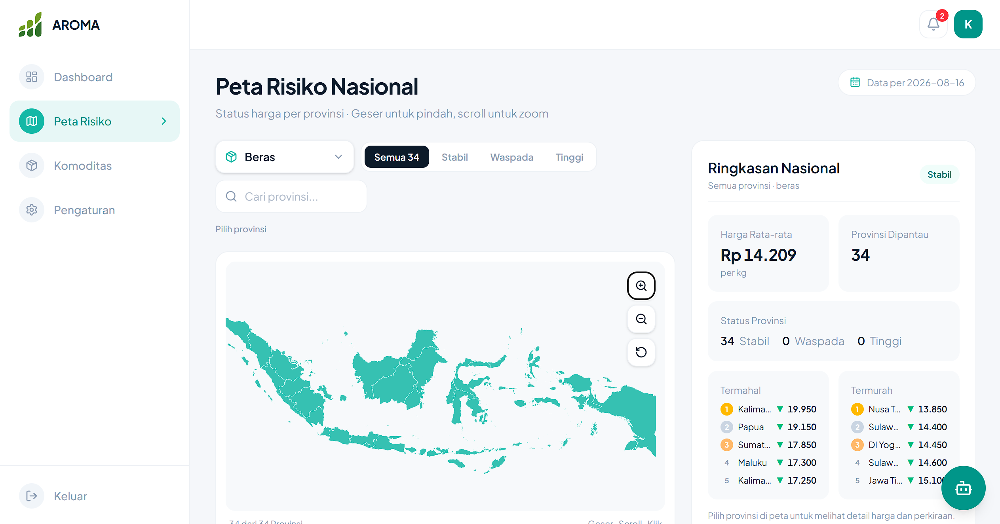
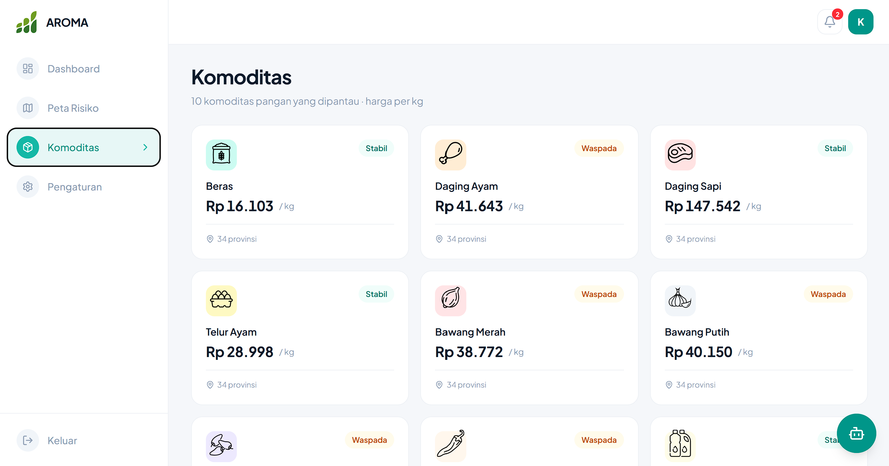
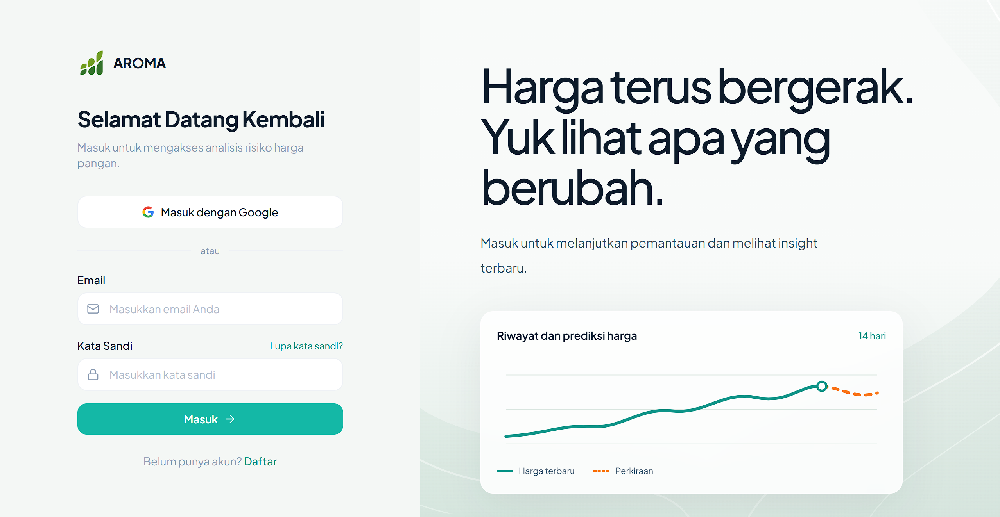
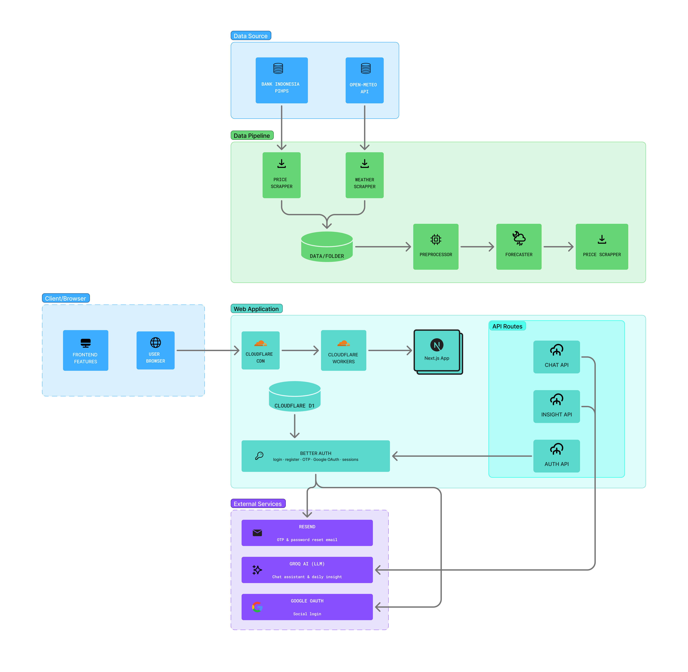
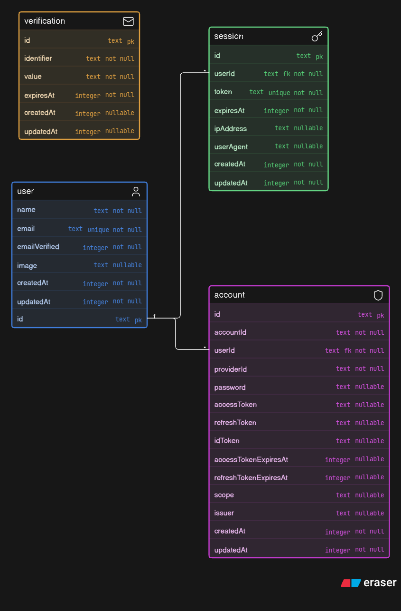

<div align="center">

  

  # AROMA

  ### Baca harga pangan. Selangkah lebih siap.

  [](https://aroma.my.id)
  [](https://github.com/kanigaraa/aroma-web)
  [](#-lisensi)

  **Submission for ITECHNO CUP 2026 - Web Development**

  **By AkaliDev**
</div>

---

## 📋 Daftar Isi

- [Tentang Proyek](#-tentang-proyek)
- [Fitur Unggulan](#-fitur-unggulan)
- [Demo & Screenshot](#-demo--screenshot)
- [Teknologi](#-teknologi)
- [Arsitektur Sistem](#-arsitektur-sistem)
- [Instalasi & Setup](#-instalasi--setup)
- [Penggunaan](#-penggunaan)
- [API Documentation](#-api-documentation)
- [Testing](#-testing)
- [Tim Developer](#-tim-developer)
- [Lisensi](#-lisensi)

---

## 👥 Tim Developer

| Nama | Peran | GitHub |
|------|-------|--------|
| **Khaliz Kanigara Fathi Gunawan** | Project Manager & Frontend Developer  | [GitHub](https://github.com/kanigaraa) |
| **Muhammad Adla Fayyaz Fauzy** | Fullstack Developer | [GitHub](https://github.com/adlafayyaz) |
| **Fathi Muhammad Luthfi Cardiana** | UI/UX Designer & System Analyst | [GitHub](https://github.com/fmluthfi) |


---

## 🎯 Tentang Proyek

### Latar Belakang

Harga pangan berubah dari waktu ke waktu dan tidak selalu bergerak sama di setiap wilayah. Data harga yang panjang juga sulit dibaca jika pengguna harus membandingkan tanggal, komoditas, dan provinsi secara manual.

AROMA **(Analisis Risiko Optimasi Masa depan Agrikultur)**, mengolah arsip harga pangan PIHPS menjadi tampilan yang dapat ditelusuri berdasarkan komoditas dan provinsi. Aplikasi ini melengkapi data historis dengan status risiko, prediksi harga 14 hari, serta konteks cuaca agar perubahan harga lebih mudah dipahami.

### Solusi yang Ditawarkan

AROMA menyatukan empat tahap analisis dalam satu aplikasi:

1. Membaca data historis harga pangan dari PIHPS.
2. Menandai penyimpangan harga berdasarkan z-score sebagai status Stabil, Waspada, atau Tinggi.
3. Membuat prediksi 14 hari untuk setiap komoditas dan provinsi menggunakan Prophet.
4. Menyajikan hubungan statistik antara harga, curah hujan, dan suhu, lalu membantu pengguna membaca hasilnya melalui asisten AI.

Data yang tersedia mencakup **10 komoditas pangan** dan **34 provinsi**. AROMA mendukung semangat SDG 9 melalui pemanfaatan teknologi web dan analisis data, serta SDG 11 melalui akses informasi pangan antarwilayah yang lebih mudah dibaca.

### Tujuan Proyek

- 🎯 **Tujuan utama:** membantu pengguna membaca riwayat, perbedaan wilayah, risiko, dan kemungkinan arah harga pangan.
- 📊 **Target pengguna:** masyarakat, pelaku usaha pangan, mahasiswa, dan pihak yang membutuhkan ringkasan harga pangan Indonesia.
- 💡 **Value proposition:** harga historis, prediksi, peta risiko, perbandingan provinsi, cuaca, dan asisten AI tersedia dalam satu alur analisis.

---

## ✨ Fitur Unggulan

### Fitur Utama

| Fitur | Deskripsi | Keunggulan |
|---|---|---|
| **Dashboard harga pangan** | Merangkum harga rata-rata, perubahan harga, status risiko, dan grafik per komoditas. | Memberikan gambaran kondisi harga tanpa membuka setiap komoditas satu per satu. |
| **Riwayat dan prediksi 14 hari** | Menggabungkan harga historis, hasil prediksi, dan rentang kemungkinan dalam satu grafik. | Membantu pengguna membaca arah pergerakan harga dan ketidakpastiannya. |
| **Peta risiko pangan** | Menampilkan status Stabil, Waspada, atau Tinggi pada peta Indonesia. | Mempermudah identifikasi perbedaan kondisi antarprovinsi. |
| **Perbandingan provinsi** | Membandingkan grafik harga hingga tiga provinsi dan menampilkan wilayah termahal maupun termurah. | Membuat perbedaan harga antarwilayah lebih mudah dinilai. |
| **Analisis pengaruh cuaca** | Menampilkan korelasi harga dengan curah hujan dan suhu pada wilayah yang memiliki data. | Memberikan konteks tambahan tanpa menyatakan korelasi sebagai hubungan sebab-akibat. |
| **Asisten AI AROMA** | Menjawab pertanyaan tentang ringkasan harga, prediksi, dan cuaca berdasarkan konteks data AROMA. | Membantu pengguna memahami angka melalui percakapan dalam Bahasa Indonesia. |

### Fitur Tambahan

- **Autentikasi akun** - Masuk melalui email dan kata sandi atau Google.
- **Verifikasi email** - Menggunakan OTP yang dikirim melalui Resend.
- **Filter peta** - Mencari provinsi dan menyaringnya berdasarkan status risiko.
- **Ambang harga** - Menyimpan batas peringatan pada browser pengguna.
- **Tur waktu** - Memutar perubahan status peta dari hari ke hari.
- **Desain responsif** - Menyesuaikan tampilan desktop, tablet, dan perangkat seluler.

---

## 📸 Demo & Screenshot

### Live Demo

🔗 **[Kunjungi Website](https://aroma.my.id)**

### Screenshot Aplikasi

#### Dashboard

<div align="center">
  
  <p><em>Dashboard AROMA menampilkan grafik harga, prediksi, status risiko, dan ringkasan antarwilayah.</em></p>
  
  <p><em>Peta risiko AROMA menampilkan status risiko harga pangan di Indonesia.</em></p>
  
  <p><em>Halaman komoditas AROMA menampilkan riwayat dan prediksi harga pangan per komoditas.</em></p>
</div>

#### Autentikasi

<div align="center">
  
</div>

### Video Demo

Video demo belum tersedia.

---

## 🛠️ Teknologi

### Tech Stack

#### Frontend

```
Framework    : Next.js 16, React 19, TypeScript
UI Library   : Tailwind CSS 4, CSS Modules
State Mgmt   : React Context
Validation   : Validasi skema Better Auth
```

#### Backend

```
Runtime      : Cloudflare Workers melalui OpenNext
Framework    : Next.js Route Handlers
Database     : Cloudflare D1 dan SQLite lokal
ORM          : Drizzle ORM
Auth         : Better Auth, Google OAuth, email OTP
```

#### DevOps & Tools

```
Deployment   : Cloudflare Workers
CI/CD        : GitHub Actions, Wrangler
Testing      : ESLint, Next.js production build
Monitoring   : Cloudflare Workers Logs
```

Visualisasi menggunakan Recharts dan SVG. Motion menggunakan GSAP dan Lenis. Asisten AI memakai Groq, pengiriman email memakai Resend, sedangkan pipeline data memakai Python, Prophet, pandas, dan Open-Meteo.

### Alasan Pemilihan Teknologi

| Teknologi | Alasan |
|---|---|
| **Next.js dan React** | Mendukung pembagian komponen server dan client, routing aplikasi, serta API dalam satu codebase TypeScript. |
| **Cloudflare Workers dan D1** | Menempatkan runtime aplikasi dan database dalam ekosistem Cloudflare yang sama. |
| **Prophet** | Menghasilkan prediksi deret waktu beserta batas bawah dan atas untuk menunjukkan rentang kemungkinan. |
| **Recharts dan SVG** | Menyajikan data harga dan peta secara interaktif serta responsif. |
| **Better Auth** | Menangani autentikasi email, sesi, Google OAuth, dan plugin OTP dengan integrasi database. |
| **Groq** | Menjalankan model bahasa untuk menjelaskan data AROMA melalui ringkasan dan percakapan. |

### Dependencies Utama

```json
{
  "dependencies": {
    "next": "^16.3.4",
    "react": "19.2.8",
    "better-auth": "^1.7.2",
    "drizzle-orm": "^0.45.2",
    "@opennextjs/cloudflare": "^1.20.6",
    "recharts": "^3.10.1",
    "gsap": "^3.15.0",
    "lenis": "^1.3.26",
    "resend": "^6.25.0"
  }
}
```

---

## 🏗️ Arsitektur Sistem

### System Architecture



### Database Schema



### Folder Structure

```text
aroma-web/
|-- .github/
|   `-- workflows/        # CI/CD deployment Cloudflare Workers
|-- data/
|   |-- raw/              # Data mentah PIHPS
|   |-- processed/        # Harga bersih dan status risiko
|   |-- forecast/         # Prediksi harga 14 hari
|   |-- weather/          # Data cuaca per provinsi
|   |-- insight/          # Hasil analisis korelasi cuaca
|   `-- map-precomputed.json
|-- docs/                 # Dokumentasi fitur dan integrasi
|-- migrations/           # Migrasi skema Cloudflare D1
|-- public/
|   |-- cursors/          # Cursor khusus antarmuka
|   |-- icons/            # Ikon komoditas
|   `-- *.png, *.jpg      # Logo, diagram, dan screenshot
|-- scripts/              # Scraper, praproses, forecast, dan build data
|-- src/
|   |-- app/
|   |   |-- (app)/        # Dashboard, peta, komoditas, dan pengaturan
|   |   `-- api/          # Auth, chatbot, insight, dan data grafik
|   |-- components/
|   |   |-- auth/         # Komponen autentikasi
|   |   `-- landing/      # Komponen landing page
|   |-- data/             # GeoJSON peta Indonesia
|   `-- lib/
|       `-- generated/    # Konteks data untuk chatbot
|-- tests/                # Pengujian chatbot
|-- precompute-map.cjs    # Generator cache geometri peta
|-- open-next.config.ts   # Adapter Next.js untuk Cloudflare Workers
`-- wrangler.toml         # Binding, route, dan konfigurasi Worker
```

---

## ⚙️ Instalasi & Setup

### Prerequisites

- Node.js 22 atau lebih baru
- npm
- Git
- Akun Cloudflare untuk mencoba Worker dan D1
- Kredensial Google OAuth, Resend, dan Groq untuk mengaktifkan seluruh fitur

### Langkah Instalasi

#### 1️⃣ Clone Repository

```bash
git clone https://github.com/kanigaraa/aroma-web.git
cd aroma-web
```

#### 2️⃣ Install Dependencies

```bash
npm install
```

#### 3️⃣ Setup Environment Variables

Buat file `.env` di root project. Jangan commit file ini.

```env
BETTER_AUTH_URL="http://localhost:3000"
BETTER_AUTH_SECRET="ganti-dengan-secret-yang-kuat"

GOOGLE_CLIENT_ID=""
GOOGLE_CLIENT_SECRET=""

RESEND_API_KEY=""

GROQ_API_KEY=""
GROQ_MODEL="qwen/qwen3.8-27b"
```

`GOOGLE_CLIENT_ID` dan `GOOGLE_CLIENT_SECRET` diperlukan untuk login Google. `RESEND_API_KEY` diperlukan untuk pengiriman OTP. `GROQ_API_KEY` diperlukan untuk ringkasan dan asisten AI.

#### 4️⃣ Setup Database

Mode development menggunakan SQLite lokal pada file `.dev.db`. File tersebut dibuat secara lokal dan tidak boleh dimasukkan ke Git.

Untuk menjalankan migrasi pada D1 lokal:

```bash
npx wrangler d1 migrations apply aroma-db --local
```

Untuk menerapkan migrasi ke D1 production:

```bash
npx wrangler d1 migrations apply aroma-db --remote
```

#### 5️⃣ Run Development Server

```bash
npm run dev
```

Buka [http://localhost:3000](http://localhost:3000).

---

## 🚀 Penggunaan

### Menjalankan Aplikasi

```bash
# Development mode
npm run dev

# Production build
npm run build
npm run start

# Preview Cloudflare Worker
npm run preview

# Linting
npm run lint
```

### User Guide

#### Untuk Pengguna Umum

1. Buka landing page untuk melihat preview data harga dan cakupan wilayah.
2. Pilih **Masuk**, lalu login menggunakan email dan kata sandi atau Google.
3. Jika membuat akun baru, masukkan OTP yang dikirim ke email untuk menyelesaikan verifikasi.
4. Buka **Dashboard** untuk melihat ringkasan harga dan status komoditas.
5. Buka **Peta Risiko** untuk memilih komoditas, mencari provinsi, memfilter status, dan membandingkan wilayah.
6. Buka **Komoditas** untuk melihat riwayat, prediksi 14 hari, rentang kemungkinan, serta pengaruh cuaca.
7. Gunakan tombol asisten untuk menanyakan ringkasan harga atau arah prediksi berdasarkan data AROMA.

#### Untuk Admin

AROMA belum menyediakan peran atau panel admin khusus pada versi ini.

### Deployment Cloudflare

```bash
# Verifikasi build OpenNext dari branch lokal
npm run build:open-next
```

Produksi hanya di-deploy oleh GitHub Actions setelah perubahan masuk ke branch `main`. Workflow menerapkan migrasi D1, membangun aplikasi, mengunggah Worker, lalu mengaktifkan versi terbaru. Repository memerlukan secret `CLOUDFLARE_API_TOKEN`; Account ID dibaca dari `wrangler.toml`.

---

## 📚 API Documentation

### Base URL

```text
Development: http://localhost:3000/api
Production:  https://aroma.my.id/api
```

### Endpoints

#### Authentication

```http
GET  /api/auth/*
POST /api/auth/*
```

Better Auth menangani pendaftaran, login, logout, sesi, Google OAuth, dan email OTP melalui endpoint tersebut.

#### Asisten AI

```http
POST /api/chat
```

Mengirim percakapan ke asisten AI dengan konteks data AROMA.

#### Ringkasan Insight

```http
POST /api/insight
```

Membuat ringkasan kondisi harga dari data dashboard.

### Example Request

```javascript
const response = await fetch("/api/chat", {
  method: "POST",
  headers: { "Content-Type": "application/json" },
  body: JSON.stringify({
    messages: [
      { role: "user", content: "Bagaimana arah harga beras?" }
    ]
  })
});

const result = await response.json();
```

---

## 🧪 Testing

### Running Tests

Repository menyediakan dua pemeriksaan utama:

```bash
npm run lint
npm run build
npm run test:chat
```

### Test Coverage

Pengujian unit, integrasi, E2E, dan laporan coverage belum dikonfigurasi pada `package.json`, sehingga README tidak mencantumkan angka coverage yang belum terukur.

---

## 📄 Lisensi

Hak cipta (c) 2026 AkaliDev. Semua hak dilindungi.

Repository ini belum menyertakan lisensi open source. Penggunaan, penyalinan, atau distribusi kode memerlukan izin dari pemegang hak cipta.

---

<div align="center">
  **Made with ❤️ by AkaliDev for ITECHNO CUP 2026**
</div>
